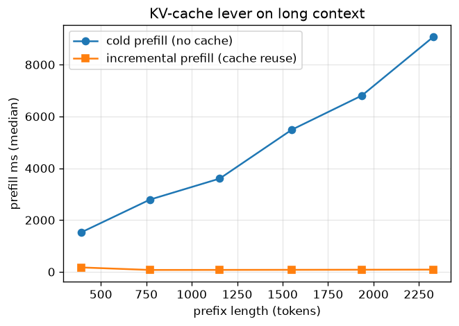
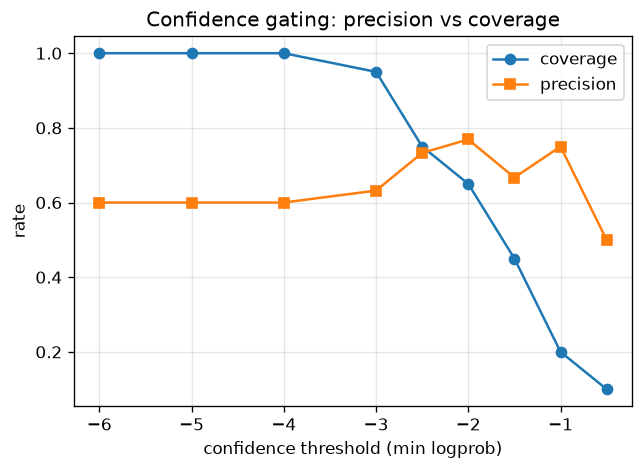
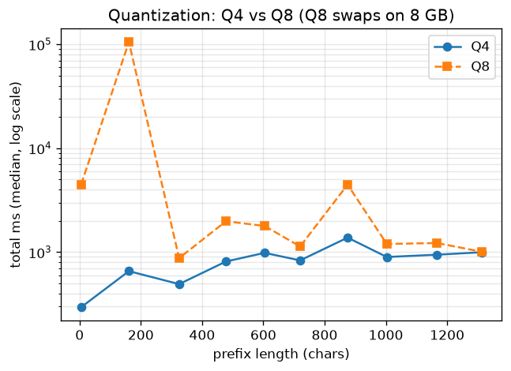

# Local Autocomplete with llama.cpp

A small harness that drives a **local** autocomplete loop — as you type, a base LM running
on-device (`gemma-4-E2B`, via `llama.cpp`) predicts the continuation — and measures both
**latency** and **suggestion quality** honestly.

See **[WRITEUP.md](WRITEUP.md)** for the analysis (the five questions) and **[results/](results/)**
for the measured numbers, charts, and example suggestions.

**Run on:** MacBook Air, Apple M1, 8 GB RAM, macOS 14.2.1 (Metal).

## Results at a glance

Full analysis in [WRITEUP.md](WRITEUP.md); raw numbers and all charts in [results/](results/).
*(Absolute latencies are inflated by thermal throttling on the fanless M1 — relative comparisons hold.)*

### Latency — KV-cache reuse is the biggest lever

On a long context, **cold prefill scales to ~9 s at 2,300 tokens while cache reuse stays flat at ~80 ms (~100x)**:



Output length is the other knob (fewer tokens → less decode):

| output granularity | n_predict | median | p90 |
|---|---|---|---|
| word | 3 | 543 ms | 960 ms |
| phrase–sentence | 16 | 828 ms | 1,734 ms |
| multi-line | 64 | 887 ms | 1,940 ms |

### Accuracy — 60% exact next-word (a floor)

Many "misses" are valid-but-different (model `"next chapter of the Chicago Bulls"` vs true `"next era of Bulls basketball"`). Gating on token logprobs trades coverage for precision (**60% base rate → ~77% precision at 65% coverage**):



### Quantization — ship Q4

Q8 (4.6 GB) doesn't fit cleanly on 8 GB; it swaps catastrophically (a 105 s call), so **Q4 (~3 GB) is the on-device target**:



### Model choice — base, not `-it`

base continues raw text cleanly; `-it` leaks chatbot artifacts on raw prefixes and, used as a chat model, spends 774 chars "thinking" before answering. See [results/model_headtohead.md](results/model_headtohead.md).

## How it works

The harness walks a cursor through a passage; at each stop it sends the text-so-far (a growing
prefix) to `llama-server`'s `/completion` endpoint and records TTFT, server-side prefill/decode
timings, the suggestion, and token logprobs.

| file | role |
|------|------|
| `client.py` | talk to `llama-server` (streaming TTFT + `timings` + logprobs) |
| `walk.py` | growing-prefix cursor positions |
| `harness.py` | drive the walk; warm-up + repetitions → `Record`s |
| `metrics.py` | next-word match, prefix overlap, boundary truncation, precision/coverage |
| `stats.py` | median / p90 |
| `experiments.py` | cache on/off, granularity sweep, decoding, accuracy, latency profile |
| `longcontext.py` | long-context cache supplement (cold vs incremental prefill) |
| `middle_of_text.py` | Q4 demo: causal model ignores the suffix |
| `headtohead.py` | Q1 evidence: base vs `-it` |
| `analyze.py` | CSVs → charts + `results/summary.md` |
| `passages.py` | the test passages |
| `run_server.sh`, `convert.sh` | serve / build the model |

## Reproduce

```bash
# 1. llama.cpp (provides llama-server + llama-quantize)
brew install llama.cpp

# 2. Python env (harness deps)
python3 -m venv .venv
.venv/bin/pip install -r requirements.txt

# 3. Build the model. Base gemma-4-E2B ships only as a 10 GB multimodal safetensors
#    with no GGUF, so we convert the text tower ourselves.
git clone --depth 1 https://github.com/ggml-org/llama.cpp
.venv/bin/pip install -r llama.cpp/requirements/requirements-convert_hf_to_gguf.txt
.venv/bin/pip install -U "transformers>=5.12"   # gemma-4 tokenizer needs transformers 5.x

mkdir -p models/gemma-4-E2B-base
# config + tokenizer (small):
for f in config.json generation_config.json tokenizer.json tokenizer_config.json; do
  curl -L -o "models/gemma-4-E2B-base/$f" \
    "https://huggingface.co/google/gemma-4-E2B/resolve/main/$f"
done
# weights (~10 GB) — use direct curl; the HF "Xet" path can hang on unauthenticated pulls:
curl -L -C - -o models/gemma-4-E2B-base/model.safetensors \
  "https://huggingface.co/google/gemma-4-E2B/resolve/main/model.safetensors"

./convert.sh        # -> models/gemma4-base-Q4_K_M.gguf (+ Q8_0)

# 4. Serve + measure
./run_server.sh models/gemma4-base-Q4_K_M.gguf 8080 &        # add a 3rd arg for ctx-size
.venv/bin/python experiments.py                              # core suite -> results/*.csv
./run_server.sh models/gemma4-base-Q4_K_M.gguf 8080 4096 &   # long ctx for the supplement
.venv/bin/python longcontext.py
.venv/bin/python analyze.py                                  # charts + results/summary.md

# unit tests (pure logic)
PYTHONPATH=. .venv/bin/python -m pytest tests/ -v
```

> **Note:** the GGUFs, the safetensors, `.venv`, and the `llama.cpp` clone are git-ignored
> (too large to ship). The steps above rebuild them. Design docs are under
> `docs/superpowers/`.
